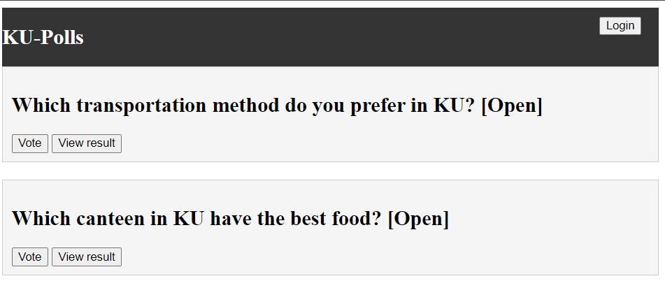

# KU Polls: Online Survey Questions 
[](https://github.com/SariyaP/ku-polls/actions/workflows/django.yml)
[](https://github.com/SariyaP/ku-polls/actions/workflows/flake8.yml)

An application to conduct online polls and surveys based
on the [Django Tutorial project](https://docs.djangoproject.com/en/4.1/intro/tutorial02/), with
additional features.

This app was created as part of the [Individual Software Process](
https://cpske.github.io/ISP) course at [Kasetsart University](https://www.ku.ac.th).
## Application Screenshot



## Installation

Django >= 5.1

python-decouple >= 3.8

## Running the Application
Please follows [installation.md](./installation.md) step by step.
## Set environment variables
on Window

```sh
 python copy sample.env .env
 ```

on MacOS / Linux

```sh
 python cp sample.env .env 
 ```

## Demo Users
| Username  | Password        |
|-----------|-----------------|
|   demo1   | hackme11 |
|   demo2   | hackme22 |
|   demo3   | hacnkme33 |

## Project Documents
All project documents are in the [Project Wiki](../../wiki).

- [Vision Statement](../../wiki/Vision-and-Scope)
- [Requirements](../../wiki/Requirements)
- [Project Plan](../../wiki/Project-Plan)
  - [Iteration 1](../../wiki/Iteration-1-Plan)
  - [Iteration 2](../../wiki/Iteration-2-Plan)
  - [Iteration 3](../../wiki/Iteration-3-Plan)
  - [Iteration 4](../../wiki/Iteration-4-Plan)
